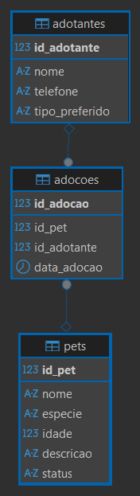

# PetMatch

O PetMatch é um sistema desenvolvido para facilitar e organizar o processo de adoção de animais por ONGs e abrigos.  
Ele permite cadastrar pets, gerenciar adotantes e registrar adoções de forma simples e eficiente, garantindo controle e rastreabilidade.

---

## Funcionalidades do Sistema

### Pets
- Cadastrar novo pet  
- Listar pets cadastrados  
- Atualizar dados de um pet  
- Excluir pet  
- Filtrar pets disponíveis para adoção  
- Alterar status para "Adotado" após registro de adoção  

---

### Adotantes
- Cadastrar adotante  
- Listar adotantes  
- Buscar adotantes por nome  

---

### Adoções
- Registrar adoção 
- Consultar histórico de adoções  
- Verificar automaticamente se o pet está disponível antes da adoção

---

## DER

  

